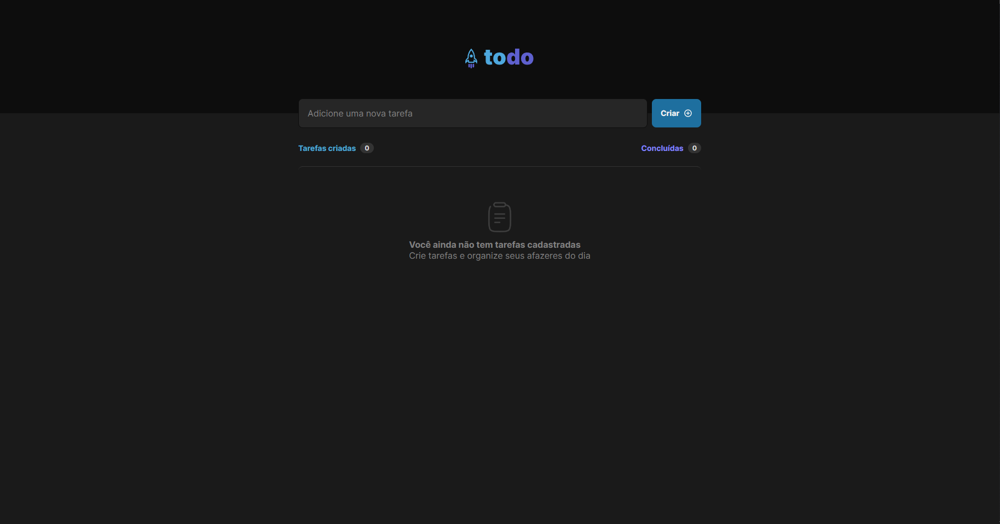
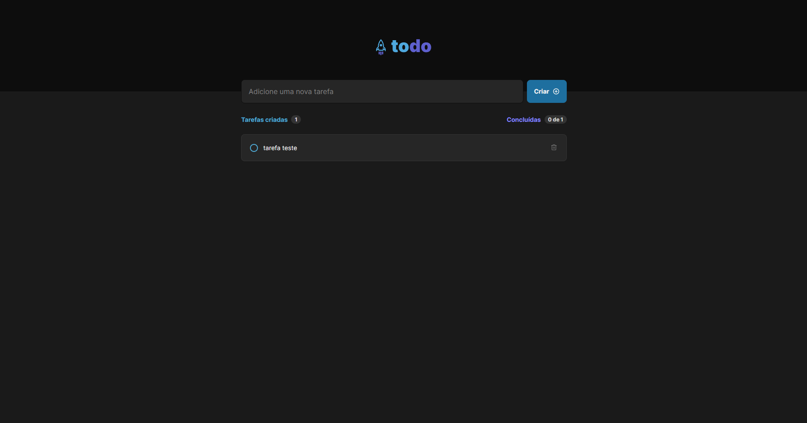

# React to do list

Neste projeto, proposto como um desafio no curso ignite da rocketseat, criei uma lista para controle de tarefas do dia a dia, onde é possível adicionar tarefas novas, marcá-las e desmarcá-las como realizadas e excluir tarefas.

